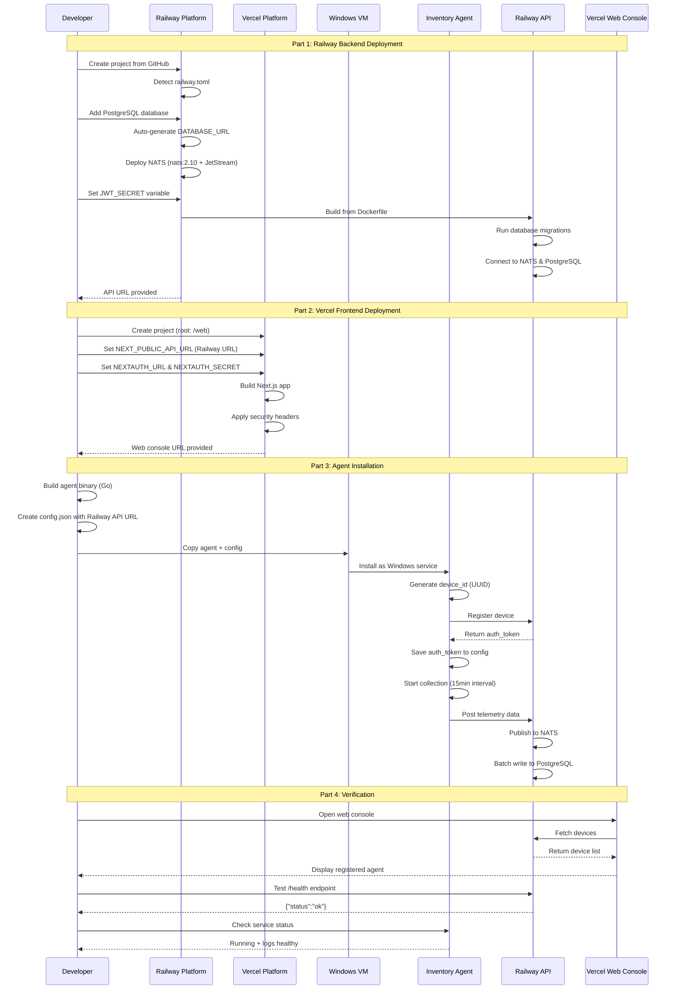

# Windows Inventory Agent & Cloud Console - Deployment Guide

## Vercel + Railway Deployment Stack

This guide provides comprehensive instructions for deploying the Windows Inventory Agent & Cloud Console system using Vercel (frontend) and Railway (backend) platforms.

## Table of Contents

1. [Introduction](#introduction)
2. [Prerequisites](#prerequisites)
3. [Part 1: Railway Backend Deployment](#part-1-railway-backend-deployment)
4. [Part 2: Vercel Frontend Deployment](#part-2-vercel-frontend-deployment)
5. [Part 3: Agent Build and VM Installation](#part-3-agent-build-and-vm-installation)
6. [Part 4: Post-Deployment Verification](#part-4-post-deployment-verification)
7. [Troubleshooting](#troubleshooting)
8. [Environment Variables Reference](#environment-variables-reference)
9. [Additional Resources](#additional-resources)
10. [Next Steps](#next-steps)
11. [Support and Troubleshooting](#support-and-troubleshooting)

## Introduction

### Overview

The Windows Inventory Agent & Cloud Console system consists of three main components:

- **Inventory Agent**: Windows service that collects system metrics (CPU, memory, disk, software inventory, OS info)
- **API Backend**: Go-based REST API with PostgreSQL database and NATS JetStream messaging
- **Web Console**: Next.js application for device management and inventory visualization

This deployment uses:
- **Railway**: Managed PostgreSQL, NATS JetStream, and containerized API deployment
- **Vercel**: Next.js web console deployment with edge network optimization

### Deployment Architecture



### Estimated Deployment Time

- **Railway setup**: 15-20 minutes
- **Vercel setup**: 10-15 minutes
- **Agent build and first VM installation**: 15-20 minutes
- **Verification and testing**: 15-20 minutes
- **Total: 55-75 minutes** (first-time deployment)

### Alternative Deployment Methods

For alternative deployment methods (Docker, Kubernetes), see [`docs/DEPLOYMENT.md`](docs/DEPLOYMENT.md).

## Prerequisites

### Accounts and Access

- **Vercel account**: Free tier sufficient for testing ([vercel.com](https://vercel.com))
- **Railway account**: Free tier includes $5/month credit ([railway.app](https://railway.app))
- **GitHub account**: With repository access to `tulsie-narine/agent`
- **VM access**: Windows Server 2019+ or Windows 10+ for agent installation

### Local Development Tools

- **Git**: For repository cloning
- **Node.js 20+**: For local testing
- **Go 1.22+**: For building agent binaries
- **OpenSSL**: For generating secrets (`openssl rand -base64 32`)
- **Railway CLI** (optional): `npm i -g @railway/cli`
- **Vercel CLI** (optional): `npm i -g vercel`

### Required Information

- List of target VMs for agent deployment
- Domain names (optional, for custom domains)
- SSL certificates (if using custom domains)

## Part 1: Railway Backend Deployment

### Step 1: Create Railway Project

1. Navigate to Railway dashboard ([railway.app](https://railway.app))
2. Click "New Project" → "Deploy from GitHub repo"
3. Authenticate with GitHub and select the repository `tulsie-narine/agent`
4. Railway will detect the `railway.toml` configuration automatically

### Step 2: Add PostgreSQL Database

1. In the Railway project, click "New" → "Database" → "Add PostgreSQL"
2. Railway provisions a managed PostgreSQL 16 instance
3. Note that `DATABASE_URL` is automatically generated and injected
4. No manual configuration needed for the database service

### Step 3: Configure NATS Service

Railway automatically deploys NATS from the `railway.toml` configuration:
- **Image**: `nats:2.10` with JetStream enabled
- **Startup command**: `["-js", "--http_port", "8222"]`
- **Health check**: Port 8222 (HTTP monitoring endpoint)
- **Internal URL**: `nats://nats:4222` for service-to-service communication

### Step 4: Configure API Service Environment Variables

Navigate to the `api` service in Railway dashboard → "Variables" tab:

**Auto-configured variables:**
- `DATABASE_URL`: Auto-injected from PostgreSQL service
- `NATS_URL`: `nats://nats:4222` (from `railway.toml`)
- `API_PORT`: `8080`
- `LOG_LEVEL`: `info`
- `RATE_LIMIT_RPS`: `100`
- `MAX_BATCH_SIZE`: `1000`

**Required manual variable:**
- `JWT_SECRET`: Generate using `openssl rand -base64 32`

Save all variables.

### Step 5: Deploy API Service

Railway automatically builds from `api/Dockerfile`:
1. Multi-stage Docker build (Go compilation + minimal runtime)
2. Dependencies installed via `go mod download`
3. Binary compiled with optimizations
4. Migrations copied to `/app/migrations`
5. Deployment waits for PostgreSQL and NATS health checks
6. API runs database migrations automatically on startup

### Step 6: Verify Railway Deployment

**Check service status:**
- PostgreSQL: Should show "Active" with connection info
- NATS: Should show "Healthy" (health check passing on port 8222)
- API: Should show "Healthy" (health check passing on `/health` endpoint)

**View deployment logs:**
- Click on API service → "Logs" tab
- Look for "Migrations completed successfully"
- Look for "NATS connected" and "JetStream stream created: TELEMETRY"
- Look for "Server started on port 8080"

**Get the API public URL:**
- Click on API service → "Settings" tab → "Domains"
- Copy the URL (e.g., `https://api-production-xxxx.up.railway.app`)

**Test the health endpoint:**
```bash
curl https://your-api-url.railway.app/health
# Expected: {"status":"ok"}
```

## Part 2: Vercel Frontend Deployment

### Step 1: Create Vercel Project

1. Navigate to Vercel dashboard ([vercel.com](https://vercel.com))
2. Click "Add New" → "Project"
3. Import the GitHub repository `tulsie-narine/agent`
4. Configure project settings:
   - **Framework Preset**: Next.js (auto-detected)
   - **Root Directory**: `web`
   - **Build Command**: `npm run build` (auto-detected)
   - **Output Directory**: `.next` (auto-detected)

### Step 2: Configure Environment Variables

In Vercel project settings → "Environment Variables" tab, add:

**Required Variables:**
- `NEXT_PUBLIC_API_URL`: Railway API URL from Part 1, Step 6
  - Example: `https://api-production-xxxx.up.railway.app`
- `NEXTAUTH_URL`: Vercel deployment URL
  - Production: `https://your-app-name.vercel.app`
  - Preview: Leave empty (auto-detected)
- `NEXTAUTH_SECRET`: Generate with `openssl rand -base64 32`

**Optional Variables:**
- `NEXT_PUBLIC_ANALYTICS_ID`: Google Analytics ID (if using analytics)

### Step 3: Deploy to Vercel

1. Click "Deploy" button
2. Vercel will:
   - Clone the repository
   - Install dependencies (`npm install` in `/web` directory)
   - Run build command (`npm run build`)
   - Apply configuration from `web/vercel.json` (security headers, optimizations)
   - Deploy to Vercel's edge network
3. Monitor build logs for any errors
4. Deployment typically takes 2-3 minutes

### Step 4: Verify Vercel Deployment

- Open the provided URL (e.g., `https://your-app-name.vercel.app`)
- Verify the web console loads successfully
- Check browser console for API connection errors
- Test basic functionality (should show "No devices" if no agents registered)

### Step 5: Configure Custom Domain (Optional)

1. In Vercel project settings → "Domains" tab
2. Add custom domain (e.g., `console.yourdomain.com`)
3. Follow Vercel's DNS configuration instructions
4. Update `NEXTAUTH_URL` environment variable
5. Redeploy the application

## Part 3: Agent Build and VM Installation

### Step 1: Build Agent Binary

**On Windows development machine:**
```powershell
# Clone repository (if not already done)
git clone https://github.com/tulsie-narine/agent.git
cd agent/agent

# Build for Windows (64-bit)
go build -o inventory-agent.exe -ldflags "-s -w" .

# Verify binary
.\inventory-agent.exe -version
```

**Cross-compilation from Linux/macOS:**
```bash
cd agent/agent
GOOS=windows GOARCH=amd64 go build -o inventory-agent.exe -ldflags "-s -w" .
```

Binary size: ~15-20 MB (single executable, no dependencies).

### Step 2: Create Agent Configuration

Create `config.json` based on `agent/config.example.json`:

```json
{
  "device_id": "",
  "api_endpoint": "https://your-api-url.railway.app",
  "auth_token": "",
  "collection_interval": "15m",
  "enabled_metrics": {
    "os.info": true,
    "cpu": true,
    "memory": true,
    "disk": true,
    "software": true
  },
  "local_output_path": "C:\\ProgramData\\InventoryAgent\\inventory.json",
  "log_level": "info",
  "retry_config": {
    "max_retries": 5,
    "backoff_multiplier": 2.0,
    "max_backoff": "5m"
  }
}
```

**Configuration Notes:**
- `device_id`: Leave empty (auto-generated UUID v4 on first run)
- `api_endpoint`: Railway API URL from Part 1, Step 6
- `auth_token`: Leave empty (obtained during registration)
- `collection_interval`: Minimum 1 minute
- `enabled_metrics`: Reference `agent/internal/collectors/`
- `local_output_path`: Fallback storage if API unavailable
- `log_level`: debug, info, warn, error
- `retry_config`: Exponential backoff for API failures

### Step 3: Prepare Installation Package

Create deployment folder structure:
```
InventoryAgent/
├── inventory-agent.exe
├── config.json
└── install.ps1
```

Create `install.ps1` script:
```powershell
# Installation script content
# - Create C:\ProgramData\InventoryAgent directory
# - Copy binary and config to installation directory
# - Install as Windows service: inventory-agent.exe -service install
# - Start the service: inventory-agent.exe -service start
# - Verify service: Get-Service InventoryAgent
```

Reference service installation logic in `agent/main.go` lines 126-156.

### Step 4: Deploy to VM

**Manual Installation (Single VM):**

1. Copy `InventoryAgent` folder to target VM
2. Open PowerShell as Administrator
3. Navigate to folder: `cd C:\Path\To\InventoryAgent`
4. Run installation: `.\install.ps1`
5. Verify service: `Get-Service InventoryAgent`
6. Check logs: `Get-Content C:\ProgramData\InventoryAgent\agent.log -Tail 50`

**Automated Deployment (Multiple VMs):**

**PowerShell Remoting:**
```powershell
# Deploy to multiple VMs
$vms = @("VM1", "VM2", "VM3")
Invoke-Command -ComputerName $vms -FilePath .\install.ps1
```

**Group Policy Deployment:**
- Create GPO for software installation
- Build MSI using WiX Toolset (reference `tools/deployment/installer.wxs`)
- Deploy via Group Policy Software Installation
- Configure startup script to set `api_endpoint`

**Configuration Management:**
- Use Ansible, Puppet, or Chef
- Template `config.json` with environment-specific values
- Ensure service is started and enabled

### Step 5: Verify Agent Installation

**On each VM:**

1. **Check Service Status:**
   ```powershell
   Get-Service InventoryAgent
   # Should show Status: Running
   ```

2. **Check Configuration:**
   ```powershell
   Get-Content C:\ProgramData\InventoryAgent\config.json
   # Verify device_id auto-generated
   # Verify api_endpoint correct
   ```

3. **Check Local Output:**
   ```powershell
   Get-Content C:\ProgramData\InventoryAgent\inventory.json
   # Should contain collected metrics
   ```

4. **Check Logs:**
   ```powershell
   Get-Content C:\ProgramData\InventoryAgent\agent.log -Tail 50
   # Look for "Agent started successfully"
   # Look for "Registration successful"
   # Look for "Telemetry posted successfully"
   ```

5. **Verify in Web Console:**
   - Open Vercel-deployed web console
   - Navigate to Devices page
   - VM should appear within 1-2 minutes
   - Click device to view inventory data

## Part 4: Post-Deployment Verification

### End-to-End Testing

1. **Test Agent Registration:**
   - Install agent on test VM
   - Monitor Railway API logs for registration
   - Verify device appears in web console
   - Check `auth_token` saved in `config.json`

2. **Test Telemetry Flow:**
   - Wait for collection interval or restart agent
   - Monitor API logs for telemetry ingestion
   - Check NATS logs for message publishing
   - Verify PostgreSQL batch writes
   - Refresh web console for updated data

3. **Test Policy Distribution (if implemented):**
   - Create policy in web console
   - Assign to device
   - Monitor agent logs for policy application
   - Verify behavior changes

4. **Test Command Execution (if implemented):**
   - Issue command from web console
   - Monitor agent logs for execution
   - Verify results in web console

### Performance Verification

**Agent Performance:**
- CPU usage: <1% average
- Memory usage: <60 MB
- Check: `Get-Process inventory-agent | Select-Object CPU, WorkingSet`

**API Performance:**
- Ingest latency: <300ms p95 for 10k agents
- Monitor in Railway dashboard → API service → Metrics

**Web Console Performance:**
- Page load time: <500ms p95
- Check browser DevTools → Performance tab

### Security Verification

1. **TLS Configuration:**
   - Railway API: `curl -I https://your-api-url.railway.app`
   - Vercel web: `curl -I https://your-app-name.vercel.app`
   - TLS version: 1.2 or 1.3

2. **Security Headers:**
   - Check Vercel headers (from `web/vercel.json`):
     - X-Frame-Options: DENY
     - X-Content-Type-Options: nosniff
     - Referrer-Policy: strict-origin-when-cross-origin
     - Permissions-Policy: camera=(), microphone=(), geolocation=()
   - Test: `curl -I https://your-app-name.vercel.app`

3. **Authentication:**
   - Test unauthorized access: `curl https://your-api-url.railway.app/api/devices`
   - Should return 401 Unauthorized

### Monitoring Setup

1. **Railway Monitoring:**
   - Enable notifications: Project Settings → Notifications
   - Alert for health check failures, high error rates, resource usage

2. **Vercel Monitoring:**
   - Enable Analytics (optional, paid)
   - Monitor deployment status and build failures

3. **Application Monitoring:**
   - Review API logs daily for errors
   - Monitor database size growth
   - Check NATS JetStream storage usage

## Troubleshooting

### Railway Deployment Issues

**Problem: API service fails to start**
- **Symptoms:** API shows "Crashed" in Railway dashboard
- **Diagnosis:** Check API logs for startup errors
- **Common Causes:**
  1. PostgreSQL not ready: Wait for health check
  2. Missing `JWT_SECRET`: Add in environment variables
  3. Migration failure: Check logs, verify migrations in Docker image
  4. NATS connection failure: Verify NATS healthy
- **Solution:** Verify dependencies healthy, check variables, review startup sequence, redeploy

**Problem: NATS service health check failing**
- **Symptoms:** NATS shows "Unhealthy"
- **Diagnosis:** Check logs, test health endpoint
- **Common Causes:**
  1. JetStream not enabled: Verify `-js` flag
  2. Port 8222 not exposed
  3. Resource constraints
- **Solution:** Verify `railway.toml` config, increase resources if needed

**Problem: Database migrations fail**
- **Symptoms:** "Migration failed" in API logs
- **Diagnosis:** Check specific error, verify PostgreSQL accessible
- **Common Causes:**
  1. Migrations not in Docker image
  2. Insufficient permissions
  3. Syntax errors
  4. Duplicate execution
- **Solution:** Verify Dockerfile copies migrations, check permissions, review migration files

### Vercel Deployment Issues

**Problem: Build fails on Vercel**
- **Symptoms:** Deployment shows "Failed", build errors
- **Diagnosis:** Review build logs
- **Common Causes:**
  1. Missing dependencies in `package.json`
  2. TypeScript errors
  3. Environment variables not set
  4. Node.js version mismatch
- **Solution:** Verify dependencies, run `npm run build` locally, check Node.js version (20+)

**Problem: Web console can't connect to API**
- **Symptoms:** "API connection failed" errors
- **Diagnosis:** Check browser console, network tab
- **Common Causes:**
  1. `NEXT_PUBLIC_API_URL` incorrect
  2. Railway API down
  3. CORS issues
  4. Network/firewall blocking
- **Solution:** Verify `NEXT_PUBLIC_API_URL`, test API directly, check CORS config

**Problem: Authentication not working**
- **Symptoms:** Login fails, session errors
- **Diagnosis:** Check browser console, Vercel function logs
- **Common Causes:**
  1. `NEXTAUTH_SECRET` not set
  2. `NEXTAUTH_URL` incorrect
  3. JWT issues with Railway API
  4. Cookie problems
- **Solution:** Verify auth variables, ensure cookies allowed, review NextAuth config

### Agent Installation Issues

**Problem: Agent service won't start**
- **Symptoms:** Service shows "Stopped"
- **Diagnosis:** Check Event Viewer, agent logs
- **Common Causes:**
  1. Invalid `config.json`
  2. Insufficient permissions
  3. Corrupted binary
  4. Port conflicts
- **Solution:** Validate JSON, verify permissions, rebuild binary, check startup logic

**Problem: Agent can't connect to API**
- **Symptoms:** "Registration failed" or "Connection refused"
- **Diagnosis:** Check agent logs, test connectivity
- **Common Causes:**
  1. `api_endpoint` incorrect
  2. Firewall blocking HTTPS
  3. Railway API down
  4. Network issues
  5. TLS validation failures
- **Solution:** Verify endpoint, test connectivity, check firewall, verify API health

**Problem: Agent not appearing in web console**
- **Symptoms:** Agent running but device not shown
- **Diagnosis:** Check agent logs, API logs, database
- **Common Causes:**
  1. Registration failed silently
  2. `auth_token` not saved
  3. Telemetry not posted
  4. Database write failures
  5. Web console caching
- **Solution:** Verify registration success, check `auth_token`, restart agent, check API logs, hard refresh console

**Problem: High agent resource usage**
- **Symptoms:** >5% CPU or >100 MB RAM
- **Diagnosis:** Monitor process, check config
- **Common Causes:**
  1. Collection interval too short
  2. Too many metrics enabled
  3. Large software inventory
  4. Memory leak
- **Solution:** Increase interval, disable metrics, restart agent, upgrade if needed

### General Troubleshooting Tips

1. **Check Service Health:**
   - Railway: Dashboard → Each service → Health status
   - Vercel: Dashboard → Deployment status
   - Agent: `Get-Service InventoryAgent` on each VM

2. **Review Logs:**
   - Railway API: Dashboard → API service → Logs
   - Vercel: Dashboard → Functions → View logs
   - Agent: `C:\ProgramData\InventoryAgent\agent.log`

3. **Test Connectivity:**
   - API health: `curl https://your-api-url.railway.app/health`
   - Web console: Browser DevTools console
   - Agent to API: `Test-NetConnection your-api-url.railway.app -Port 443`

4. **Verify Configuration:**
   - Railway: Check environment variables
   - Vercel: Check `NEXT_PUBLIC_API_URL` and auth variables
   - Agent: Validate `config.json`

5. **Check Dependencies:**
   - PostgreSQL healthy before API starts
   - NATS healthy before API starts
   - API accessible before agents register

## Environment Variables Reference

### Railway API Service

| Variable | Required | Default | Description | Source |
|----------|----------|---------|-------------|--------|
| `DATABASE_URL` | Yes | Auto | PostgreSQL connection string | Railway (auto-injected) |
| `NATS_URL` | Yes | `nats://nats:4222` | NATS server URL for internal communication | `railway.toml` |
| `API_PORT` | Yes | `8080` | Port for API server to listen on | `railway.toml` |
| `JWT_SECRET` | Yes | - | Secret key for JWT token signing (base64) | Manual (dashboard) |
| `LOG_LEVEL` | No | `info` | Logging level: debug, info, warn, error | `railway.toml` |
| `RATE_LIMIT_RPS` | No | `100` | Rate limit requests per second | `railway.toml` |
| `MAX_BATCH_SIZE` | No | `1000` | Maximum telemetry batch size for DB writes | `railway.toml` |
| `TLS_CERT_FILE` | No | Empty | TLS certificate path (Railway handles TLS) | `railway.toml` |
| `TLS_KEY_FILE` | No | Empty | TLS key path (Railway handles TLS) | `railway.toml` |

Reference: `api/internal/config/config.go` for complete configuration structure.

### Vercel Web Console

| Variable | Required | Default | Description | Exposed to Browser |
|----------|----------|---------|-------------|--------------------|
| `NEXT_PUBLIC_API_URL` | Yes | - | Railway API URL (e.g., https://api-production-xxxx.up.railway.app) | Yes |
| `NEXTAUTH_URL` | Yes | - | Vercel deployment URL (e.g., https://your-app.vercel.app) | No |
| `NEXTAUTH_SECRET` | Yes | - | Secret for NextAuth session encryption (base64) | No |
| `NEXT_PUBLIC_ANALYTICS_ID` | No | - | Google Analytics measurement ID | Yes |

Reference: `web/.env.example` for additional optional variables.

### Agent Configuration (config.json)

| Field | Required | Default | Description |
|-------|----------|---------|-------------|
| `device_id` | No | Auto-generated | UUID v4 identifier (generated on first run) |
| `api_endpoint` | Yes | - | Railway API URL (e.g., https://api-production-xxxx.up.railway.app) |
| `auth_token` | No | Empty | JWT token obtained during registration |
| `collection_interval` | Yes | `15m` | How often to collect metrics (minimum 1m) |
| `enabled_metrics` | Yes | `{"os.info": true}` | Map of metric collectors to enable |
| `local_output_path` | Yes | `C:\ProgramData\InventoryAgent\inventory.json` | Local JSON output path |
| `log_level` | Yes | `info` | Logging level: debug, info, warn, error |
| `retry_config.max_retries` | Yes | `5` | Maximum retry attempts for API calls |
| `retry_config.backoff_multiplier` | Yes | `2.0` | Exponential backoff multiplier |
| `retry_config.max_backoff` | Yes | `5m` | Maximum backoff duration |

Reference: `agent/config.example.json` and `agent/internal/config/config.go`.

## Additional Resources

- **Railway Documentation:** https://docs.railway.app
- **Vercel Documentation:** https://vercel.com/docs
- **Project Architecture:** [`docs/ARCHITECTURE.md`](docs/ARCHITECTURE.md)
- **API Reference:** [`docs/API.md`](docs/API.md)
- **Database Schema:** [`docs/DATABASE.md`](docs/DATABASE.md)
- **Alternative Deployment Methods:** [`docs/DEPLOYMENT.md`](docs/DEPLOYMENT.md) (Docker, Kubernetes)
- **Security Best Practices:** [`docs/SECURITY.md`](docs/SECURITY.md)
- **Testing Guide:** [`docs/TESTING.md`](docs/TESTING.md)
- **Production Checklist:** [`production/deployment-checklist.md`](production/deployment-checklist.md)

## Next Steps

After successful deployment:

1. **Scale Testing:**
   - Deploy agents to additional VMs
   - Monitor Railway resource usage
   - Consider upgrading Railway plan if needed

2. **Monitoring Setup:**
   - Configure alerting for service failures
   - Set up log aggregation (optional)
   - Create performance dashboards

3. **Security Hardening:**
   - Enable Railway private networking (paid feature)
   - Configure custom domains with SSL
   - Implement IP allowlisting if needed
   - Review [`docs/SECURITY.md`](docs/SECURITY.md)

4. **Backup Configuration:**
   - Set up automated PostgreSQL backups in Railway
   - Document disaster recovery procedures
   - Test backup restoration process

5. **CI/CD Setup:**
   - Configure GitHub Actions for automated deployments
   - Set up preview deployments for pull requests
   - Implement automated testing before deployment

6. **Documentation:**
   - Document any custom configurations
   - Create runbooks for common operations
   - Train team members on deployment procedures

## Support and Troubleshooting

If you encounter issues not covered in this guide:

1. Check the troubleshooting section above
2. Review Railway and Vercel status pages for platform issues
3. Consult project documentation in `docs/`
4. Check GitHub issues for similar problems
5. Contact support:
   - Railway: https://railway.app/help
   - Vercel: https://vercel.com/support

---

## Deployment Checklist

Use this checklist to track deployment progress:

- [ ] Prerequisites completed (accounts, tools, secrets generated)
- [ ] Railway project created and PostgreSQL added
- [ ] Railway NATS service deployed and healthy
- [ ] Railway API service deployed with all environment variables
- [ ] Railway API health check passing
- [ ] Vercel project created with correct root directory
- [ ] Vercel environment variables configured
- [ ] Vercel deployment successful and web console accessible
- [ ] Agent binary built for Windows
- [ ] Agent configuration file created
- [ ] Agent installed on test VM
- [ ] Agent service running and healthy
- [ ] Test device appears in web console
- [ ] Telemetry data flowing end-to-end
- [ ] Performance metrics within acceptable ranges
- [ ] Security verification completed
- [ ] Monitoring and alerting configured
- [ ] Documentation updated with deployment-specific details

**Estimated Deployment Time:**
- Railway setup: 15-20 minutes
- Vercel setup: 10-15 minutes
- Agent build and first VM installation: 15-20 minutes
- Verification and testing: 15-20 minutes
- **Total: 55-75 minutes** (first-time deployment)

Subsequent deployments will be faster as configurations are reused.